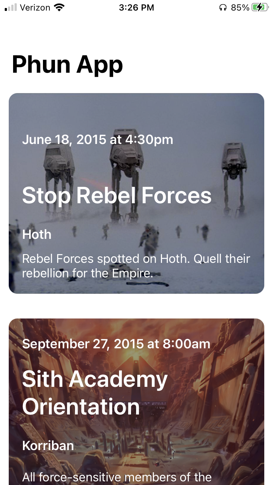
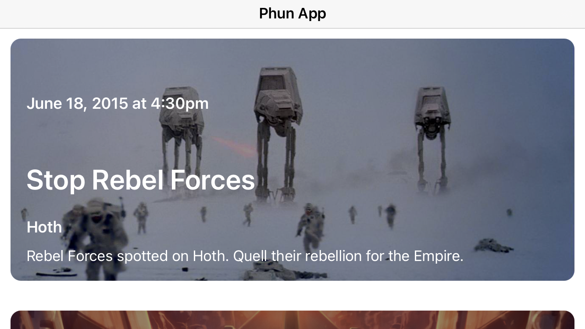
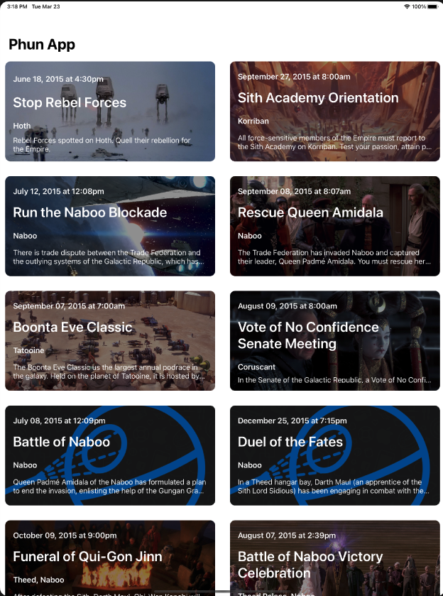
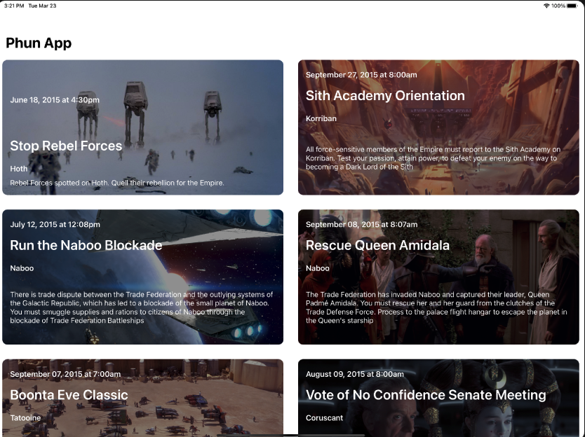

# StarWars_Mission
An app that fetches StarWars missions from
(https://raw.githubusercontent.com/MochiCurry/mockjson/main/StarWars.json) and presents its details.

## Features
- iPhone and iPad support with Auto Layout for both devices.
- iPhone presents the feed in 1 column, iPad presents it in 2 column.
- Supports all device orientations with smooth transitions.
- Dynamic cell sizing for cells with large cotent.
- Fetches list of Mission details in JSON format using Alamofire, which supports caching for offline usage.
- Missing image (nil) or broken url link is supported by placeholder image.
- Followed MVC (model-view-controller) design pattern.
- Followed Delegate Protocol pattern.
- Converted date string format.
    
## iPhone
| Home Vertical | Home Horizontal | Detail Vertical | Detail Horizontal |
| --- | --- | --- | --- |
|  |   |  |  |

## iPad
| Home Vertical | Home Horizontal | Detail Vertical | Detail Horizontal |
| --- | --- | --- | --- |
|  |   |  |  |

## Swift Package Dependencies
    Alamofire (https://github.com/Alamofire/Alamofire.git)
    SDWebImage (https://github.com/SDWebImage/SDWebImage.git)
    SnapKit (https://github.com/SnapKit/SnapKit.git)
## Versions
    XCode Version 12.4 (12D4e)
    iOS Deployment Target 14.4
